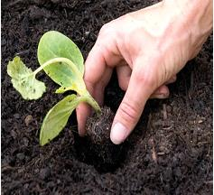
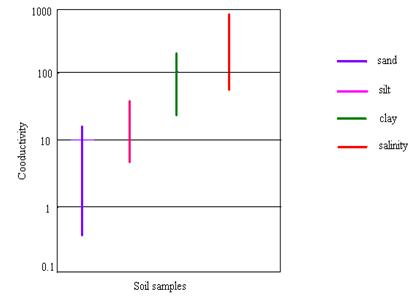

## Theory

A soil analysis is a process by which elements such as P, K, Ca, Mg, Na, S, Mn, Cu and Zn are chemically extracted from the soil and measured for their “plant available” content within the soil sample.

  

 

<h3>Significance of Soil Analysis:</h3>
<ul>
  <li>It increases the knowledge of what nutrients are especially available in our soil.</li>
  <li>It reduces the environmental impacts due to soil amendments.</li>
  <li>It increases the efficiency of resource inputs such as fertilisers and water.</li>
  <li>It helps to predict the nutritional values needed for crop production.</li>
  <li>It helps to evaluate the fertility status of soils of a country or a state or a district.</li>
</ul>

<h3>Procedure for Taking Good Soil Samples:</h3>
<ul>
  <li>Determine the soil unit (or plot).</li>
  <li>Make a traverse over the soil unit (or plot).</li>
  <li>Clean the site (with spade) from where soil sample is to be collected.</li>
  <li>Insert the spade into soil.</li>
  <li>Standing on the opposite side, again insert the spade into soil.</li>
  <li>A lump of soil is removed.</li>
  <li>A pit of ‘V’ shape is formed. Its depth should be 0–6", 0–9", or 0–12" (i.e., depth of tillage).</li>
  <li>Take out the soil-slice (like a bread slice) of ½ inch thick from both the exposed surfaces of the pit from top to bottom. This slice is also termed a furrow-slice. To collect the soil-slice, a spade may be used. Collect the soil samples in a polyethylene bucket.</li>
  <li>Collect furrow-slices from 8–10 or sometimes 20–30 sites. Select the sites at random in a zigzag (or criss-cross) manner. Distribute the sites throughout the entire soil unit (plot). In lieu of a spade, an auger may be used. Do not take prohibited samples and local problem soils.</li>
  <li>Furnish the following information in two sheets of thick paper with the sample. One sheet is folded and kept inside the bag. Another sheet is folded and attached to the bag.</li>
</ul>

<h3>Conductivity of Soil:</h3>

Conductance ‘G’ is defined as the reciprocal of Resistance ‘R’.

$$\text{i.e., }G=\frac{1}{R}$$

  The conductance of a solution is measured between two separately fixed and chemically inert electrodes. To avoid polarization at the electrode surfaces, the conductance measurement is made with an alternating current signal. The conductance of a solution ‘G’ is directly proportional to the electrode surface area A cm2, and inversely proportional to the distance between the electrodes, L cm.

  Thus, <strong>G = K (A / L)</strong> is called conductivity

  Where, <strong>K</strong> – constant of proportionality.

  Unit of <strong>K</strong> – mho/cm

  Electrical Conductivity of soil is a measurement which correlates several physical and chemical properties of soil such as soil texture, cation exchange capacity, drainage conditions, organic matter level, salinity, etc. Electrical Conductivity is the ability of a material to conduct electric current through it. It is commonly expressed in milliSiemens per meter (mS/m) or deciSiemens per meter (dS/m).

  Soil electrical conductivity varies depending on the amount of moisture held by soil particles. Conductivity values of different soil materials are given in the diagram.

From the above diagram it is clear that sands have the lowest conductivity and salinity have the highest conductivity.

